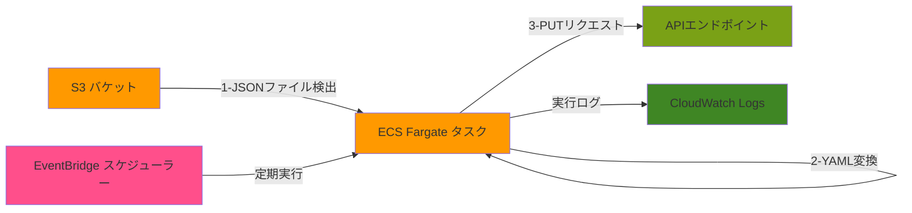

# S3 to API Converter

S3バケットに配置されたJSONファイルを定期的に検出し、YAML形式に変換してAPIエンドポイントにPUTリクエストを送信するECS Taskです。

## アーキテクチャ

- ECS Fargate Task: JSONファイルの検出、変換、APIリクエストを実行
- EventBridge Scheduler: 定期的なタスク実行をスケジュール
- CloudWatch Logs: タスクの実行ログを保存



## 作成されるAWSリソース

1. **ECS Cluster** (`aws_ecs_cluster`)
   - 名前: json-to-yaml-converter
   - Container Insightsが有効化されたクラスター

2. **CloudWatch Logs** (`aws_cloudwatch_log_group`)
   - ロググループ名: /ecs/json-to-yaml-converter
   - ログ保持期間: 7日間

3. **IAMロール**
   - ECSタスク実行ロール (`aws_iam_role.ecs_task_execution`)
     - ECSタスクの実行に必要な基本的な権限を持つ
   - ECSタスクロール (`aws_iam_role.ecs_task`)
     - S3バケットへのアクセス権限（GetObject, ListBucket, PutObject, DeleteObject）
   - スケジューラーロール (`aws_iam_role.scheduler`)
     - ECSタスクの実行とIAMロールの受け渡し権限

4. **セキュリティグループ** (`aws_security_group.ecs_task`)
   - 名前: json-to-yaml-converter-task
   - アウトバウンド: すべてのトラフィックを許可

5. **ECSタスク定義** (`aws_ecs_task_definition`)
   - ファミリー名: json-to-yaml-converter
   - 起動タイプ: FARGATE
   - ネットワークモード: awsvpc
   - 環境変数:
     - S3_BUCKET: 監視対象のバケット名
     - API_ENDPOINT: 送信先APIエンドポイント

6. **EventBridgeスケジュール** (`aws_scheduler_schedule`)
   - 名前: json-to-yaml-converter-schedule
   - Flexible Time Window: OFF
   - 実行間隔: 変数で設定可能（デフォルト: 5分）
   - 起動設定:
     - FARGATE起動タイプ
     - パブリックIPの割り当て無効

## 前提条件

- Terraform
- AWS CLI
- 対象のS3バケットが作成済み
- VPCとサブネットが設定済み
- コンテナイメージがECRにプッシュ済み

## セットアップ手順

1. Terraformの設定

terraform.tfvars.exampleをコピーして必要な値を設定します：

```bash
cp terraform.tfvars.example terraform.tfvars
```

terraform.tfvarsを編集し、以下の値を設定：
- s3_bucket_name: 監視対象のS3バケット名
- vpc_id: 使用するVPC ID
- subnet_ids: 使用するサブネットID（2つ以上）
- container_image: ビルドしたコンテナイメージのURI

2. Terraformの実行

```bash
# 初期化
terraform init

# 実行計画の確認
terraform plan

# リソースの作成
terraform apply
```

## 環境変数

- `S3_BUCKET`: 監視対象のS3バケット名
- `S3_PREFIX`: （オプション）監視対象のS3バケット内のプレフィックス
- `API_ENDPOINT`: YAMLデータを送信するAPIエンドポイントURL

## 動作確認

1. S3バケットにJSONファイルをアップロード
2. CloudWatch Logsで実行ログを確認
3. APIエンドポイントでリクエストを確認

## ログの確認

CloudWatch Logsのロググループ `/ecs/json-to-yaml-converter` で実行ログを確認できます。

## リソースの削除

```bash
terraform destroy
```

## トラブルシューティング

1. タスクが起動しない場合
   - セキュリティグループの設定を確認
   - IAMロールの権限を確認
   - VPCエンドポイントの設定を確認

2. S3ファイルにアクセスできない場合
   - タスクロールのS3権限を確認
   - バケット名とプレフィックスの設定を確認

3. APIリクエストが失敗する場合
   - APIエンドポイントのURLを確認
   - ネットワーク接続（VPCの設定）を確認
   - セキュリティグループのアウトバウンドルールを確認
